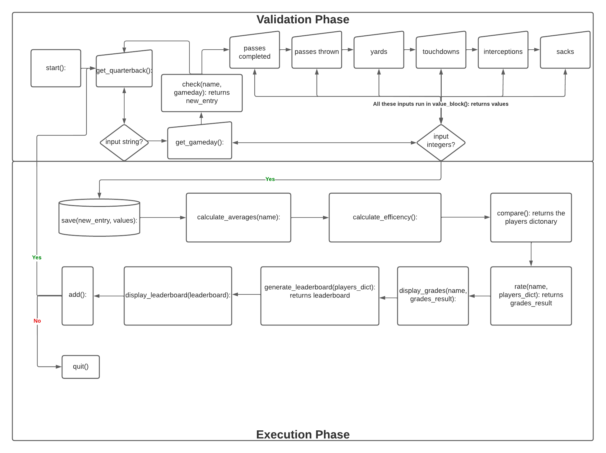
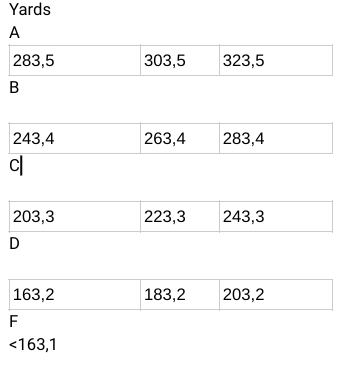
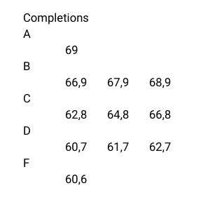
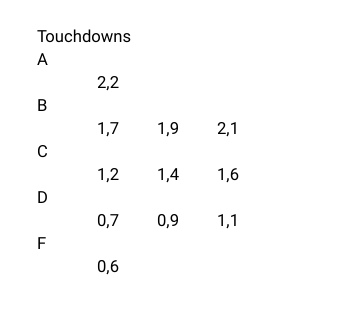
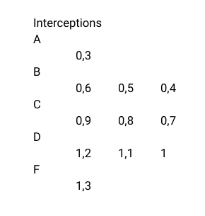
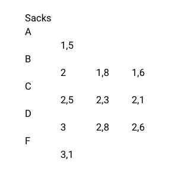

# Quarterback performance app
## A python command-line application for American Football lovers

[Click here for the full website access](https://quarterback-performance.herokuapp.com/)

## Table of contents
1. [Introduction](#introduction) 
2. [Preparation - UX and UXD](#preparation)
3. [Features](#features)
4. [Testing](#testing)
5. [Deployment](#deployment) 
6. [Application instructions and further notes](#application-instructions-and-further-notes)
7. [Credits / attributes](#credits) 

## Introduction 
The Quarterback Performance app (or for further purposes: "QPA" ), is a tool for passionate american football fans to measure the performance of quarterbacks. It is designed to solve the following problem: In isolation, statistics from football games are not meaningful and can therefore give a distorted picture of reality. Furthermore, the QPA should disprove or support the subjective perception of a player's performance by numbers. 

## Preparation - UX and UXD

The Python app is aimed at all football fans who also love statistics. In American sports, statistics are treated very differently than, for example, soccer in Europe and therefore have a much higher value. It may sound like a bold, exaggerated statement but: Football fans who don't like statistics don't exist. This also explains the hype surrounding so-called fantasy leagues, in which players can put together their own team. 

In terms of user experience, it is definitely more difficult to design an attractive interface or the like for a pure command-line tool, since the resources for this are not available. Nevertheless, it makes sense to deal with this topic, since there is also an input and output in the terminal. 
It is important with the inputs that it is clearly communicated which values or data types are expected and if these do not meet the requirements, the user also receives direct feedback with a note. 

The output should of course also be easy to understand and quickly accessible to the user through a structured listing of the relevant information. 

The **UXD - User Experience Design** was declared and described in advance and includes the 3 panels strategy, scope & structure. Skeleton and Surface are omitted because wireframes, layouts, color palettes, typographies etc. are not found in the command-line. 

### Strategy 
An application about a sport, in connection with statistics is (culturally) appropriate, almost goes without saying and not for nothing there is the expression: "Football is Family".

Internet sites on statistics are a dime a dozen. So what makes the QPA special? First of all, it encourages users to collect the statistics of a match day themselves and to deal with them. Similar to a scrapbook with stickers. By specifying its own statistics, this app is also highly customized, which makes it different from complete rankings of a league. The user can therefore create his own leaderboard with his favorite players. 

In addition, the generation of information is very exciting, which is almost unavailable anywhere else, because: A quarterback's averages are not only compared to those of other quarterbacks, creating a leaderboard, but they are also compared to the default quarterback position from the previous year (i.e., averages). Thus, the user has a means of comparison that goes beyond traditional statistic rankings. 

To manage and use the data, google sheets is used as the "data store". Users with access rights can read this data store, but not edit it, in order to keep the application intact. It should be avoided that unintentionally columns or rows are swapped with each other or values are deleted, which are necessary for a smooth process. 

---
### Scope 
What is feasible? 

In terms of requirements and functional specifications, a command-line tool is also certainly to be planned differently than an app with a real frontend.  The following points are included in the app as features: 

* The user can enter the eight most important statistics into the terminal himself. These are: Last name of the quarterback, game day, passes completed, passes thrown, yards thrown, touchdowns, interceptions, sacks.
* After entering the data, the user receives a detailed list of how much a quarterback deviates from the standard values of a quarterback from last year. 
* Based on the deviations, a rating algorithm will give the player an American grade in letters, where the grade "C" corresponds to the values of the average player. 
* In addition, the values of the respective quarterback are compared with those of other entered values to create an own NFL Leaderboard.
* The data is stored in Google Sheets. Once the user has entered all the data that is important to him, he can return next week to continue exactly where he left off. This makes the application more interesting as it shows the changes over the season. 
* From this point of view, the user also decides for himself which data he wants to collect and which players appear in his leaderboard. 

What is not feasible? 

It is definitely to avoid that the user has to enter too many statistics by himself. Eight may be a lot for outsiders at first glance, but these are really the most important ones. Theoretically, you could enter more than 30 statistics, but no one would bother. Therefore, the query is based on the minimum number of required information. 

For time reasons, no more than two outputs are aimed at, namely the comparison to the standard of the last season and to other players. 

--- 
### Structure 
The navigation is self-explanatory due to the input details. 
The organization of functionality and content is best described with a flow diagram.

The functions above perform the following operations: 

start():
* Welcomes the user to the interface.
* Explains the benefits of using the app.

get_quarterback():
* Gets the name of the quarterback from the user.
* It makes sure, no number is included and the name is not "Average", because otherwise the program crashes.
* Capitalizes the first letter of the lastname.

get_gameday():
* Gets the gameday integer from the user.
* Checks if the number is between 1 and 17.

check(name, gameday):
* This function checks, if the gameday already exists in the spreadsheet.

get_values(statistic):
* This function gets all values from the user as an integer.
* It gets called with different parameters to cover any query.

value_block():
* This code block calls all get_value functions and stores them in a container.
* If the input is completed the user has the chance to check the values and change them, if he wants to.
* The function returns the container list if the user confirms the input.

save(entry, values):
* The save function takes the entry (name and gameday) and the values as arguments. 
* First, the entry tuple gets converted to a list, then the two value pairs get concatenated and then stored to the worksheet input.

calculate_averages(name):
* This function checks first, if the name is already in the sheets, or if it is the first time the user entered the name.
* If it is the first entry, the function just takes the value from the worksheet input and copies it into the averages, to save some resources.
* If the name is already in the input worksheet, the first if clause finds all entries, and trims them down to the necessary values.
* Then it converts every entry in the list to an integer number and adds all values together. Every item of the combined container then get divided by the number of entries to get the average. 
* The last 4 lines in the if clause find the existing values in the averages, deletes them, and replaces them with the new correct values.

calculate_efficency():
* The calculate_efficeny function calculates the pass completion percentage.
* It does it by grabbing and converting all values in the passes_completed and passes_thrown columns to floats in the average worksheet. 
* Then it zips them together in one container and calculates the percentage. 
* After that, the columns are updated with the new value.

compare():
* The compare function first gets the average values and stores them in a list. 
* After that, a player dictonary gets created by iterating over the players data.
* The dictonarys keys are the players, which contain a dictionary themselves.
* The players dictonary consists of the keys stats(individual player stats), diff(the difference calculated to the average values) and grades(calculated in the next function).
* The function returns the whole dictonary.

rate(name, players_dict):
* The rate function takes the complete players dict as an argument.
* It evaluates the grades for each stat by grabbing the differences to the average and comparing them to a set of conditions.
(More information about how the grades were calculated can be found in the features section)

display_grades(name, grades_result):
* The display_grades function shows the grades for the performance of the quarterback the user just entered in relation to the average values of last year.

generate_leaderboard(players_dict):
* The generate_leaderboard function takes the player_dict (without grades) as an argument and only runs, if there are two or more players in the database.
* It gets the average yards, touchdowns and interceptions and generates a score with these values. 
* After that, a leaderboard dict is created with the players name as the key and the score as the value. 
* The function returns the leaderboard.
(More information about how the score was calculated can be found in the features section)

display_leaderboard(leaderboard):
* The display_leaderboard function takes the dict leaderboard as an argument and sorts it from highest to lowest score, then displays it.

add():
* The add function is the last function to call and it asks the user, if he / she would like to continue with the QPA.
* If so, the main function gets called again, otherwise the user exits the application.

As already mentioned, Skeleton and Surface are not required. However, something can be summarized to the division and the representation also in the command-line: 
* All input fields and error messages are clearly formulated.
* The data must be listed cleanly one below the other.
* Line breaks, hashtags or other characters can be used for visual delimitation.
* An orderd list can be used to display the leaderboard. 

## Features
The following features were a decisive factor during the creation and they should help the Python app compile useful data.
* Data validation: It is checked for duplicates and for the correct entry of the individual values.
* If the name of player entries matches, the average value is automatically calculated and stored in the worksheet averages.
* The efficiency, or completion rate, is also recalculated with each entry. 
* The average scores of the players are compared to the overall average and school grades are created from this.
* A total performance score is calculated to represent offensive output.

How are these school grades made up? 
The following overview shows the mean values of the school grades in the center, with the outer margins to the left and right. The mean value of C is the mean value in this category from last year.

How are the scores made up? 
The average of touchdowns is multiplied by 2. Then the average of interceptions is subtracted. This number is then multiplied by the average of yards thrown to calculate the total score. 

Why this procedure? 
Sacks and completion percentage are undoubtedly important statisics, but are discarded in this calculation. For example, a quarterback can concede many sacks, but he can still deliver a good performance. Interceptions as malus are included in this calculation, because interceptions often lead to a good field position of the opponent, or directly to points of the opponent. Especially with few games and bad performances this score can have a negative value, which is intended. 

### Features for the future 
The following features would be ideas for further development...
* Each user gets his own spreadsheet or database by username and password. 
* More statistics can be entered / queried.
* Data validation can become even more accurate. For example, it is not possible for the number of pass completions to exceed the number of pass attempts. However, since this does not cause the program to crash, this validation was not done, but only a general confirmation query was implemented (user can enter yes or no). The same applies to the query of all integer values... Actually these must / can not be negative. Since however also thereby the program continues to run, this step was renounced. 
* A way to overwrite existing entries using the check function.

## Testing 
Syntax-wise the program was tested with pylint. After the completion of the project, neither errors nor problems were found. In the development process the most common errors were too many / too few whitespaces, too many blank lines and wrong data types that had to be converted. All errors could be fixed without much effort. 

Logic-wise, the program was run through with all values to make sure that it cannot crash. Among other things, it was discovered that a number in the quarterback name inevitably leads to a crash. At the time of project completion, no input is known to disrupt the program, which speaks for a very robust code.

## Deployment 

The deployment was secured with the help of Github and Heroku. 

On the Github side, the template provided was used and the repository was connected to heroku. 

On Heroku, a new app was created that includes Python and Node.js as technologies. In addition, variables (credentials and port values) were added. To ensure that the app is properly initialized, the requirements.txt was brought up to date. 

[The app can be found on this page right here](https://quarterback-performance.herokuapp.com/)

## Application instructions and further notes

For users who are not yet familiar with American football... 
These are the standard values per game of the last season: 
Passes completed: 22,3
Pass attempts: 34,4
Completion percentage: 64,8
Yards: 223,3
Touchdowns: 1,4
Interceptions: 0,8
Sacks: 2,3

In order to get values that are as realistic as possible, it would of course make sense to use these values as a guide and not to select values that cannot be found in a conventional game.
For more information and rules about american football, the following site is recommended: 
https://en.wikipedia.org/wiki/American_football_rules

The spreadsheet or database can be viewed at: https://docs.google.com/spreadsheets/d/1jzomPaamamyicS_RJ5QSzbrvsP8R4oTxsX2uFYE80WE/edit#gid=499135904
However, this can only be opened in viewer mode to exclude deleting the averages row. If a full access is necessary / desired, please contact me.

## Credits
The app was developed entirely by myself and no external code was copied or used in any other way. At this point I would like to give credits to the love-sandwiches project of Code Institute, which taught me how to connect and use the API of google sheets. 

General resources for research were: 
https://stackoverflow.com/freecodecamp
https://codeberryschool.com/en/
https://www.geeksforgeeks.org/
https://developers.google.com/sheets/api

However, this was only used to fix standard issues. So for example, how do I handle lists in a list, how do I convert datatypes, etc.? Only solution strategies were taken from these sources. 

The standard football values were found on the following page: 
https://www.pro-football-reference.com/years/NFL/passing.htm

I hope you have some fun with this app and that you get involved with this exciting sport. 